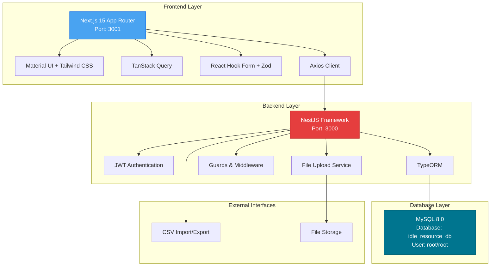
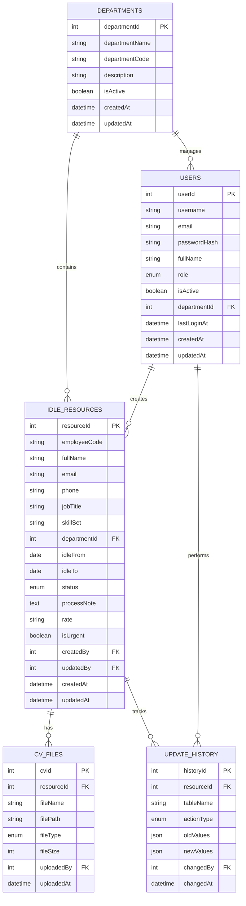
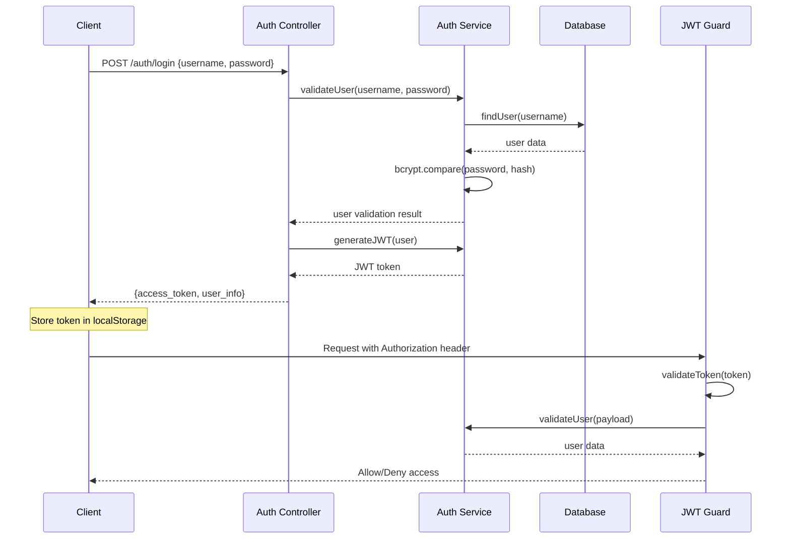

# System Architecture - Idle Resource Management System

## 1. Sơ đồ Kiến trúc Hệ thống



## 2. Technology Stack

### 2.1 Frontend Dependencies
```json
{
  "dependencies": {
    "@emotion/react": "^11.14.0",
    "@emotion/styled": "^11.14.1", 
    "@hookform/resolvers": "^5.2.1",
    "@mui/icons-material": "^7.2.0",
    "@mui/material": "^7.2.0",
    "@tanstack/react-query": "^5.84.1",
    "@tanstack/react-query-devtools": "^5.84.1",
    "axios": "^1.11.0",
    "next": "15.4.5",
    "next-auth": "^4.24.11",
    "react": "19.1.0",
    "react-dom": "19.1.0",
    "react-hook-form": "^7.61.1",
    "zod": "^4.0.14"
  },
  "devDependencies": {
    "@tailwindcss/postcss": "^4",
    "tailwindcss": "^4"
  }
}
```

### 2.2 Backend Dependencies
```json
{
  "dependencies": {
    "@nestjs/common": "^11.0.1",
    "@nestjs/core": "^11.0.1", 
    "@nestjs/platform-express": "^11.0.1",
    "@nestjs/typeorm": "^11.0.0",
    "bcrypt": "^5.1.0",
    "exceljs": "^4.4.0",
    "mysql2": "^3.6.0",
    "reflect-metadata": "^0.2.2",
    "rxjs": "^7.8.1",
    "typeorm": "^0.3.25"
  }
}
```

### 2.3 Lý do chọn Technology Stack

| Công nghệ | Lý do chọn |
|-----------|------------|
| **Next.js 15** | App Router mới, Server Components, tối ưu performance, SEO friendly |
| **Material-UI v7** | Component library mature, Argon Dashboard theme, accessibility tốt |
| **Tailwind CSS v4** | Utility-first, tích hợp tốt với MUI, responsive design dễ dàng |
| **TanStack Query** | State management cho API calls, caching, background refetch |
| **NestJS** | TypeScript-first, modular architecture, decorators, guards system |
| **TypeORM** | TypeScript ORM, entity relationships, migrations, change tracking |
| **MySQL 8.0** | Reliable, performance tốt, JSON support, window functions |

## 3. Frontend Structure

### 3.1 App Router Structure
```
src/
├── app/
│   ├── layout.tsx              # Root layout với QueryClientProvider
│   ├── page.tsx                # Landing page
│   ├── login/
│   │   └── page.tsx            # S-01-01: Login screen
│   ├── dashboard/
│   │   ├── layout.tsx          # Dashboard layout với sidebar
│   │   ├── page.tsx            # S-02-01: Dashboard
│   │   ├── users/
│   │   │   └── page.tsx        # S-03-01: User management
│   │   ├── idle-resources/
│   │   │   ├── page.tsx        # S-04-01: Idle resource list
│   │   │   └── [id]/
│   │   │       └── page.tsx    # S-04-02: Resource detail
│   │   ├── history/
│   │   │   └── page.tsx        # S-05-01: Update history
│   │   └── reports/
│   │       └── page.tsx        # S-06-01: Reports
│   └── globals.css             # Tailwind CSS imports
├── components/
│   ├── ui/                     # Reusable UI components
│   ├── forms/                  # Form components
│   ├── layout/                 # Layout components
│   └── charts/                 # Chart components
├── hooks/                      # Custom React hooks
├── lib/
│   ├── api.ts                  # Axios configuration
│   ├── auth.ts                 # Authentication utilities
│   └── utils.ts                # Utility functions
├── types/                      # TypeScript type definitions
└── middleware.ts               # Route protection
```

### 3.2 Critical Configuration Files

#### 3.2.1 Root Layout (app/layout.tsx)
```tsx
'use client';
import { QueryClient, QueryClientProvider } from '@tanstack/react-query';
import { ThemeProvider } from '@mui/material/styles';
import CssBaseline from '@mui/material/CssBaseline';
import { theme } from '@/lib/theme';
import './globals.css';

const queryClient = new QueryClient();

export default function RootLayout({ children }: { children: React.ReactNode }) {
  return (
    <html lang="en">
      <body>
        <QueryClientProvider client={queryClient}>
          <ThemeProvider theme={theme}>
            <CssBaseline />
            {children}
          </ThemeProvider>
        </QueryClientProvider>
      </body>
    </html>
  );
}
```

#### 3.2.2 Tailwind CSS Configuration (tailwind.config.ts)
```typescript
import type { Config } from 'tailwindcss';

const config: Config = {
  content: [
    "./src/pages/**/*.{js,ts,jsx,tsx,mdx}",
    "./src/components/**/*.{js,ts,jsx,tsx,mdx}",
    "./src/app/**/*.{js,ts,jsx,tsx,mdx}",
  ],
  theme: {
    extend: {
      colors: {
        'argon-blue': '#1A73E8',
        'argon-blue-light': '#49A3F1',
        'background-gray': '#F8F9FA',
      },
    },
  },
};

export default config;
```

#### 3.2.3 Global CSS (app/globals.css)
```css
@import "tailwindcss";

/* Custom Argon styles using standard CSS (NOT @apply) */
.argon-card {
  background: white;
  border-radius: 0.75rem;
  box-shadow: 0rem 0.25rem 0.375rem -0.0625rem rgba(0, 0, 0, 0.1);
}

.argon-button-gradient {
  background: linear-gradient(135deg, #49A3F1 0%, #1A73E8 100%);
  color: white !important;
  border: none;
  font-weight: 500;
  padding: 8px 16px;
  border-radius: 0.5rem;
  transition: all 0.2s ease;
}
```

#### 3.2.4 PostCSS Configuration (postcss.config.mjs)
```javascript
const config = {
  plugins: ["@tailwindcss/postcss"],
};

export default config;
```

### 3.3 Middleware Protection (src/middleware.ts)
```typescript
import { NextResponse } from 'next/server';
import type { NextRequest } from 'next/server';

export function middleware(request: NextRequest) {
  const token = request.cookies.get('auth-token')?.value;
  const { pathname } = request.nextUrl;

  // Public routes
  if (pathname === '/login') {
    if (token) {
      return NextResponse.redirect(new URL('/dashboard', request.url));
    }
    return NextResponse.next();
  }

  // Protected routes
  if (pathname.startsWith('/dashboard')) {
    if (!token) {
      return NextResponse.redirect(new URL('/login', request.url));
    }
  }

  return NextResponse.next();
}

export const config = {
  matcher: ['/', '/login', '/dashboard/:path*'],
};
```

## 4. Backend Structure

### 4.1 NestJS Module Structure
```
src/
├── main.ts                     # Application bootstrap
├── app.module.ts               # Root module
├── auth/
│   ├── auth.module.ts          # Authentication module
│   ├── auth.service.ts         # JWT service
│   ├── auth.controller.ts      # Login/logout endpoints
│   ├── guards/
│   │   ├── jwt-auth.guard.ts   # JWT verification
│   │   └── roles.guard.ts      # Role-based access
│   └── strategies/
│       └── jwt.strategy.ts     # JWT strategy
├── users/
│   ├── users.module.ts
│   ├── users.service.ts
│   ├── users.controller.ts
│   ├── entities/
│   │   └── user.entity.ts
│   └── dto/
│       ├── create-user.dto.ts
│       └── update-user.dto.ts
├── idle-resources/
│   ├── idle-resources.module.ts
│   ├── idle-resources.service.ts
│   ├── idle-resources.controller.ts
│   ├── entities/
│   │   ├── idle-resource.entity.ts
│   │   └── cv-file.entity.ts
│   └── dto/
│       ├── create-idle-resource.dto.ts
│       ├── update-idle-resource.dto.ts
│       └── filter-idle-resource.dto.ts
├── departments/
│   ├── departments.module.ts
│   ├── departments.service.ts
│   ├── departments.controller.ts
│   ├── entities/
│   │   └── department.entity.ts
│   └── dto/
│       └── create-department.dto.ts
├── history/
│   ├── history.module.ts
│   ├── history.service.ts
│   ├── history.controller.ts
│   ├── entities/
│   │   └── update-history.entity.ts
│   └── dto/
│       └── history-filter.dto.ts
├── reports/
│   ├── reports.module.ts
│   ├── reports.service.ts
│   ├── reports.controller.ts
│   └── dto/
│       └── report-filter.dto.ts
├── files/
│   ├── files.module.ts
│   ├── files.service.ts
│   ├── files.controller.ts
│   └── dto/
│       └── upload-file.dto.ts
└── common/
    ├── decorators/
    │   └── roles.decorator.ts
    ├── filters/
    │   └── http-exception.filter.ts
    └── interceptors/
        └── logging.interceptor.ts
```

### 4.2 Database Configuration (app.module.ts)
```typescript
import { Module } from '@nestjs/common';
import { TypeOrmModule } from '@nestjs/typeorm';
import { User } from './users/entities/user.entity';
import { IdleResource } from './idle-resources/entities/idle-resource.entity';
import { Department } from './departments/entities/department.entity';
import { CVFile } from './idle-resources/entities/cv-file.entity';
import { UpdateHistory } from './history/entities/update-history.entity';

@Module({
  imports: [
    TypeOrmModule.forRoot({
      type: 'mysql',
      host: 'localhost',
      port: 3306,
      username: 'root',
      password: 'root',
      database: 'idle_resource_db',
      entities: [User, IdleResource, Department, CVFile, UpdateHistory],
      synchronize: true, // Only in development
      logging: true,
      autoLoadEntities: true,
    }),
    // Other modules...
  ],
})
export class AppModule {}
```

## 5. Database Design

### 5.1 TypeORM Entities

#### 5.1.1 User Entity
```typescript
import { Entity, PrimaryGeneratedColumn, Column, CreateDateColumn, UpdateDateColumn } from 'typeorm';

@Entity('users')
export class User {
  @PrimaryGeneratedColumn()
  userId: number;

  @Column({ length: 50, unique: true })
  username: string;

  @Column({ length: 100, unique: true })
  email: string;

  @Column({ length: 255 })
  passwordHash: string;

  @Column({ length: 100, nullable: true })
  fullName: string;

  @Column({ type: 'enum', enum: ['Admin', 'RA', 'Manager', 'Viewer'] })
  role: string;

  @Column({ default: true })
  isActive: boolean;

  @Column({ nullable: true })
  departmentId: number;

  @Column({ nullable: true })
  lastLoginAt: Date;

  @CreateDateColumn()
  createdAt: Date;

  @UpdateDateColumn()
  updatedAt: Date;
}
```

#### 5.1.2 IdleResource Entity
```typescript
import { Entity, PrimaryGeneratedColumn, Column, CreateDateColumn, UpdateDateColumn, ManyToOne, OneToMany } from 'typeorm';
import { Department } from '../departments/entities/department.entity';
import { CVFile } from './cv-file.entity';

@Entity('idle_resources')
export class IdleResource {
  @PrimaryGeneratedColumn()
  resourceId: number;

  @Column({ length: 20 })
  employeeCode: string;

  @Column({ length: 100 })
  fullName: string;

  @Column({ length: 100 })
  email: string;

  @Column({ length: 20, nullable: true })
  phone: string;

  @Column({ length: 100, nullable: true })
  jobTitle: string;

  @Column({ length: 200, nullable: true })
  skillSet: string;

  @Column()
  departmentId: number;

  @Column({ type: 'date' })
  idleFrom: Date;

  @Column({ type: 'date', nullable: true })
  idleTo: Date;

  @Column({ type: 'enum', enum: ['Available', 'Assigned', 'On Leave', 'Training'], default: 'Available' })
  status: string;

  @Column({ type: 'text', nullable: true })
  processNote: string;

  @Column({ length: 20, nullable: true })
  rate: string;

  @Column({ default: false })
  isUrgent: boolean;

  @Column()
  createdBy: number;

  @Column()
  updatedBy: number;

  @CreateDateColumn()
  createdAt: Date;

  @UpdateDateColumn()
  updatedAt: Date;

  @ManyToOne(() => Department)
  department: Department;

  @OneToMany(() => CVFile, cvFile => cvFile.resource)
  cvFiles: CVFile[];
}
```

#### 5.1.3 Department Entity
```typescript
import { Entity, PrimaryGeneratedColumn, Column, CreateDateColumn, UpdateDateColumn } from 'typeorm';

@Entity('departments')
export class Department {
  @PrimaryGeneratedColumn()
  departmentId: number;

  @Column({ length: 100 })
  departmentName: string;

  @Column({ length: 20, unique: true })
  departmentCode: string;

  @Column({ length: 500, nullable: true })
  description: string;

  @Column({ default: true })
  isActive: boolean;

  @CreateDateColumn()
  createdAt: Date;

  @UpdateDateColumn()
  updatedAt: Date;
}
```

### 5.2 Database Relationships


## 6. Authentication & Authorization

### 6.1 JWT Authentication Flow


### 6.2 Role-based Access Control

#### 6.2.1 Roles Decorator
```typescript
import { SetMetadata } from '@nestjs/common';

export const ROLES_KEY = 'roles';
export const Roles = (...roles: string[]) => SetMetadata(ROLES_KEY, roles);
```

#### 6.2.2 Roles Guard
```typescript
import { Injectable, CanActivate, ExecutionContext } from '@nestjs/common';
import { Reflector } from '@nestjs/core';
import { ROLES_KEY } from '../decorators/roles.decorator';

@Injectable()
export class RolesGuard implements CanActivate {
  constructor(private reflector: Reflector) {}

  canActivate(context: ExecutionContext): boolean {
    const requiredRoles = this.reflector.getAllAndOverride<string[]>(ROLES_KEY, [
      context.getHandler(),
      context.getClass(),
    ]);
    
    if (!requiredRoles) {
      return true;
    }
    
    const { user } = context.switchToHttp().getRequest();
    return requiredRoles.some((role) => user.role === role);
  }
}
```

#### 6.2.3 Controller Usage
```typescript
@Controller('idle-resources')
@UseGuards(JwtAuthGuard, RolesGuard)
export class IdleResourcesController {
  @Get()
  @Roles('Admin', 'RA', 'Manager', 'Viewer')
  findAll() {
    return this.idleResourcesService.findAll();
  }

  @Post()
  @Roles('Admin', 'RA')
  create(@Body() createDto: CreateIdleResourceDto) {
    return this.idleResourcesService.create(createDto);
  }

  @Put(':id')
  @Roles('Admin', 'RA', 'Manager')
  update(@Param('id') id: string, @Body() updateDto: UpdateIdleResourceDto) {
    return this.idleResourcesService.update(+id, updateDto);
  }
}
```

## 7. File Management

### 7.1 File Upload Service
```typescript
import { Injectable } from '@nestjs/common';
import { diskStorage } from 'multer';
import { extname } from 'path';

@Injectable()
export class FilesService {
  getMulterOptions() {
    return {
      storage: diskStorage({
        destination: './uploads/cv',
        filename: (req, file, callback) => {
          const uniqueSuffix = Date.now() + '-' + Math.round(Math.random() * 1e9);
          const ext = extname(file.originalname);
          callback(null, `${file.fieldname}-${uniqueSuffix}${ext}`);
        },
      }),
      fileFilter: (req, file, callback) => {
        const allowedTypes = /\.(pdf|doc|docx|xls|xlsx)$/i;
        if (allowedTypes.test(extname(file.originalname))) {
          callback(null, true);
        } else {
          callback(new Error('Invalid file type'), false);
        }
      },
      limits: {
        fileSize: 10 * 1024 * 1024, // 10MB
      },
    };
  }
}
```

### 7.2 File Controller
```typescript
@Controller('files')
@UseGuards(JwtAuthGuard)
export class FilesController {
  constructor(private readonly filesService: FilesService) {}

  @Post('upload')
  @UseInterceptors(FileInterceptor('file'))
  @Roles('Admin', 'RA', 'Manager')
  uploadFile(@UploadedFile() file: Express.Multer.File, @Body() body: any) {
    return this.filesService.saveFileInfo(file, body.resourceId);
  }

  @Get(':id/download')
  @Roles('Admin', 'RA', 'Manager')
  downloadFile(@Param('id') id: string, @Res() res: Response) {
    return this.filesService.downloadFile(+id, res);
  }
}
```

## 8. Dashboard & Reporting

### 8.1 Dashboard Data Aggregation
```typescript
@Injectable()
export class ReportsService {
  constructor(
    @InjectRepository(IdleResource)
    private idleResourceRepository: Repository<IdleResource>,
  ) {}

  async getDashboardStats(): Promise<DashboardStats> {
    const totalIdle = await this.idleResourceRepository.count();
    
    const urgentIdle = await this.idleResourceRepository.count({
      where: { isUrgent: true }
    });

    const byDepartment = await this.idleResourceRepository
      .createQueryBuilder('resource')
      .leftJoin('resource.department', 'dept')
      .select('dept.departmentName', 'department')
      .addSelect('COUNT(*)', 'count')
      .groupBy('dept.departmentId')
      .getRawMany();

    const byStatus = await this.idleResourceRepository
      .createQueryBuilder('resource')
      .select('resource.status', 'status')
      .addSelect('COUNT(*)', 'count')
      .groupBy('resource.status')
      .getRawMany();

    return {
      totalIdle,
      urgentIdle,
      byDepartment,
      byStatus,
      lastUpdated: new Date(),
    };
  }
}
```

### 8.2 CSV Export Service
```typescript
import * as ExcelJS from 'exceljs';

@Injectable()
export class ExportService {
  async exportToExcel(data: IdleResource[]): Promise<Buffer> {
    const workbook = new ExcelJS.Workbook();
    const worksheet = workbook.addWorksheet('Idle Resources');

    worksheet.columns = [
      { header: 'Employee Code', key: 'employeeCode', width: 15 },
      { header: 'Full Name', key: 'fullName', width: 25 },
      { header: 'Email', key: 'email', width: 30 },
      { header: 'Department', key: 'departmentName', width: 20 },
      { header: 'Idle From', key: 'idleFrom', width: 15 },
      { header: 'Status', key: 'status', width: 15 },
      { header: 'Is Urgent', key: 'isUrgent', width: 10 },
    ];

    worksheet.addRows(data);

    const buffer = await workbook.xlsx.writeBuffer();
    return buffer as Buffer;
  }
}
```

## 9. Development Setup

### 9.1 Docker Compose (docker-compose.yml)
```yaml
version: '3.8'

services:
  mysql:
    image: mysql:8.0
    container_name: idle_resource_mysql
    environment:
      MYSQL_ROOT_PASSWORD: root
      MYSQL_DATABASE: idle_resource_db
    ports:
      - "3306:3306"
    volumes:
      - mysql_data:/var/lib/mysql
    command: --default-authentication-plugin=mysql_native_password

volumes:
  mysql_data:
```

### 9.2 Package Scripts

#### Frontend (package.json)
```json
{
  "scripts": {
    "dev": "next dev -p 3001",
    "build": "next build",
    "start": "next start -p 3001",
    "lint": "next lint"
  }
}
```

#### Backend (package.json)
```json
{
  "scripts": {
    "start": "nest start",
    "start:dev": "nest start --watch",
    "start:debug": "nest start --debug --watch",
    "start:prod": "node dist/main",
    "build": "nest build"
  }
}
```

### 9.3 Database Seeding
```typescript
import { Injectable } from '@nestjs/common';
import { InjectRepository } from '@nestjs/typeorm';
import { Repository } from 'typeorm';
import { User } from '../users/entities/user.entity';
import { Department } from '../departments/entities/department.entity';
import * as bcrypt from 'bcrypt';

@Injectable()
export class SeedService {
  constructor(
    @InjectRepository(User)
    private userRepository: Repository<User>,
    @InjectRepository(Department)
    private departmentRepository: Repository<Department>,
  ) {}

  async seed() {
    // Create departments
    const departments = [
      { departmentName: 'IT Department', departmentCode: 'IT' },
      { departmentName: 'HR Department', departmentCode: 'HR' },
      { departmentName: 'Finance Department', departmentCode: 'FIN' },
    ];

    for (const dept of departments) {
      await this.departmentRepository.save(dept);
    }

    // Create admin user
    const adminUser = {
      username: 'admin',
      email: 'admin@company.com',
      passwordHash: await bcrypt.hash('admin123', 10),
      fullName: 'System Administrator',
      role: 'Admin',
      isActive: true,
    };

    await this.userRepository.save(adminUser);
  }
}
```

## 10. Performance & Security Considerations

### 10.1 Performance Optimizations
- **Frontend**: TanStack Query caching, React.memo for components, lazy loading
- **Backend**: Database indexing, query optimization, pagination
- **Database**: Proper indexes on frequently queried columns

### 10.2 Security Measures
- **Authentication**: JWT tokens with expiration
- **Authorization**: Role-based access control
- **Input Validation**: Zod schemas, NestJS pipes
- **File Upload**: Type validation, size limits
- **CORS**: Configured for frontend domain only

### 10.3 Monitoring & Logging
- **Backend**: NestJS built-in logger
- **Database**: TypeORM query logging
- **Error Handling**: Global exception filters
- **API Documentation**: Swagger/OpenAPI integration

This architecture provides a solid foundation for the Idle Resource Management System, optimized for hackathon development speed while maintaining production-ready patterns and security measures.
