# BASIC DESIGN - PHẦN 1-2: SCREEN LIST VÀ SCREEN TRANSITION

## Phần 1: Screen List

Dựa vào Screen List và Feature List từ tài liệu System Requirement Definition, bảng tổng hợp các màn hình trong hệ thống IRMS:

| ID màn hình | Tên Màn hình | Role có thể sử dụng | Phân cấp Menu đến màn hình chức năng | Mô tả các chức năng chính |
|-------------|--------------|-------------------|-------------------------------------|---------------------------|
| **S-01-01** | Màn hình đăng nhập (Login Screen) | Tất cả | / (Root) | **FR-01**: Đăng nhập hệ thống<br>**FR-02**: Kiểm tra bảo mật và session timeout<br>- Xác thực username/password<br>- Tạo session và token<br>- Redirect đến Dashboard |
| **S-02-01** | Màn hình tổng quan (Dashboard/Top Screen) | Tất cả | /dashboard | **FR-21**: Dashboard báo cáo theo bộ phận<br>**FR-22**: Dashboard so sánh với tuần trước<br>- Hiển thị left menu navigation<br>- Thống kê tổng quan idle resources<br>- Quick access đến các chức năng chính |
| **S-03-01** | Màn hình quản lý người dùng (User Management) | Admin | /dashboard/users | **FR-03**: Quản lý phân quyền người dùng<br>- CRUD operations cho users<br>- Phân quyền role cho từng user<br>- Quản lý trạng thái active/inactive |
| **S-04-01** | Màn hình quản lý danh sách Idle Resources (Resource List) | Admin, RA, MNG, Viewer | /dashboard/resources | **FR-04**: Xem danh sách idle resource<br>**FR-10**: Tìm kiếm idle resource<br>**FR-11**: Ẩn/hiện và cố định cột<br>**FR-12**: Import dữ liệu idle<br>**FR-13**: Export dữ liệu idle<br>**FR-16**: Download nhiều CV<br>**FR-17**: Highlight resource theo idle date<br>**FR-18**: Hiển thị icon urgent |
| **S-04-02** | Màn hình chi tiết/chỉnh sửa Idle Resource (Resource Detail/Edit) | Admin, RA, MNG | /dashboard/resources/:id | **FR-05**: Thêm mới idle resource<br>**FR-06**: Cập nhật idle resource<br>**FR-08**: Xóa idle resource<br>**FR-14**: Upload CV<br>**FR-15**: Download CV<br>- Form chi tiết thông tin nhân sự<br>- CV management |
| **S-05-01** | Màn hình lịch sử cập nhật (Update History) | Admin, RA, MNG | /dashboard/history | **FR-19**: Lưu lịch sử cập nhật<br>- Hiển thị log tất cả thay đổi<br>- Filter theo user, action, timeframe<br>- Export history reports |
| **S-06-01** | Màn hình báo cáo Dashboard (Report Dashboard) | Admin, RA, MNG | /dashboard/reports | **FR-20**: Export báo cáo<br>**FR-21**: Dashboard báo cáo theo bộ phận<br>**FR-22**: Dashboard so sánh với tuần trước<br>- Various dashboard views<br>- Export reports (PDF/CSV/Excel) |

### Role Permission Matrix

| Màn hình | Admin | RA | MNG | Viewer | Ghi chú |
|----------|-------|----|----|--------|---------|
| S-01-01 | ✅ | ✅ | ✅ | ✅ | Tất cả role cần đăng nhập |
| S-02-01 | ✅ | ✅ | ✅ | ✅ | Dashboard khác nhau theo role |
| S-03-01 | ✅ | ❌ | ❌ | ❌ | Chỉ Admin quản lý users |
| S-04-01 | ✅ | ✅ | ✅ | ✅ (hạn chế) | Viewer không thấy rate, process note |
| S-04-02 | ✅ | ✅ | ✅ (bộ phận) | ❌ | Manager chỉ edit bộ phận mình |
| S-05-01 | ✅ | ✅ | ✅ (bộ phận) | ❌ | Manager chỉ xem history bộ phận mình |
| S-06-01 | ✅ | ✅ | ✅ (bộ phận) | ❌ | Manager chỉ xem reports bộ phận mình |

## Phần 2: Sơ đồ luồng di chuyển màn hình

### 2.1 Overall Screen Flow Diagram

```mermaid
flowchart TD
    A[S-01-01: Login Screen] --> B[S-02-01: Dashboard]
    
    %% Admin Flow
    B -->|Admin| C[S-03-01: User Management]
    B -->|Admin| D[S-04-01: Resource List - Full Access]
    B -->|Admin| E[S-05-01: Update History - All]
    B -->|Admin| F[S-06-01: Reports - All Departments]
    
    %% RA Flow  
    B -->|RA| D2[S-04-01: Resource List - Full Access]
    B -->|RA| E2[S-05-01: Update History - All]
    B -->|RA| F2[S-06-01: Reports - All Departments]
    
    %% Manager Flow
    B -->|Manager| D3[S-04-01: Resource List - Department]
    B -->|Manager| E3[S-05-01: Update History - Department]
    B -->|Manager| F3[S-06-01: Reports - Department]
    
    %% Viewer Flow
    B -->|Viewer| D4[S-04-01: Resource List - Read Only]
    
    %% Resource Detail/Edit Flow
    D --> G[S-04-02: Resource Detail/Edit]
    D2 --> G
    D3 --> G2[S-04-02: Resource Detail/Edit - Department Only]
    
    %% Back to list
    G --> D
    G2 --> D3
    
    %% Return to Dashboard
    C --> B
    E --> B
    E2 --> B
    E3 --> B
    F --> B
    F2 --> B
    F3 --> B
    
    %% Logout (from any screen)
    B -.->|Logout| A
    C -.->|Logout| A
    D -.->|Logout| A
    E -.->|Logout| A
    F -.->|Logout| A
    G -.->|Logout| A
    
    %% Styling
    style A fill:#e1f5fe
    style B fill:#f3e5f5
    style C fill:#fff3e0
    style D fill:#e8f5e8
    style D2 fill:#e8f5e8
    style D3 fill:#fff8e1
    style D4 fill:#f1f8e9
    style G fill:#e8f5e8
    style G2 fill:#fff8e1
    style E fill:#fff8e1
    style E2 fill:#fff8e1
    style E3 fill:#fff8e1
    style F fill:#fce4ec
    style F2 fill:#fce4ec
    style F3 fill:#fce4ec
```



### 2.2 Chi tiết luồng di chuyển theo Role

#### 2.2.1 Admin Flow (Toàn quyền)
```
📱 S-01-01: Login
    ↓ [Successful authentication]
📊 S-02-01: Dashboard (Admin View)
    ├── 👥 S-03-01: User Management
    │   ├── [Add New User] → [User Form] → [Save] → S-03-01
    │   ├── [Edit User] → [User Form] → [Update] → S-03-01
    │   └── [Back] → S-02-01
    ├── 📋 S-04-01: Resource List (Full Access)
    │   ├── [Add New] → S-04-02 (Create Mode)
    │   ├── [Edit Resource] → S-04-02 (Edit Mode)
    │   ├── [Bulk Actions] → [Confirm] → S-04-01
    │   ├── [Import] → [File Upload] → [Validate] → S-04-01
    │   ├── [Export] → [Download File] → S-04-01
    │   └── [Back] → S-02-01
    ├── 📝 S-05-01: Update History (All Records)
    │   ├── [Filter] → [Apply] → S-05-01
    │   ├── [Export History] → [Download] → S-05-01
    │   └── [Back] → S-02-01
    └── 📊 S-06-01: Report Dashboard (All Departments)
        ├── [Department Filter] → [Apply] → S-06-01
        ├── [Export Report] → [Download] → S-06-01
        └── [Back] → S-02-01
```

#### 2.2.2 RA (Resource Administrator) Flow
```
📱 S-01-01: Login
    ↓ [Successful authentication]
📊 S-02-01: Dashboard (RA View)
    ├── 📋 S-04-01: Resource List (Full Access)
    │   ├── [Add New] → S-04-02 (Create Mode)
    │   ├── [Edit Resource] → S-04-02 (Edit Mode)
    │   ├── [Bulk Operations] → [Confirm] → S-04-01
    │   ├── [Import/Export] → [Process] → S-04-01
    │   └── [Back] → S-02-01
    ├── 📝 S-05-01: Update History (All Records)
    │   └── [Back] → S-02-01
    └── 📊 S-06-01: Report Dashboard (All Departments)
        └── [Back] → S-02-01
```

#### 2.2.3 Manager Flow (Hạn chế theo bộ phận)
```
📱 S-01-01: Login
    ↓ [Successful authentication]
📊 S-02-01: Dashboard (Manager View - Department Limited)
    ├── 📋 S-04-01: Resource List (Department Only)
    │   ├── [Add New] → S-04-02 (Create Mode - Department)
    │   ├── [Edit Resource] → S-04-02 (Edit Mode - Department)
    │   └── [Back] → S-02-01
    ├── 📝 S-05-01: Update History (Department Only)
    │   └── [Back] → S-02-01
    └── 📊 S-06-01: Report Dashboard (Department Only)
        └── [Back] → S-02-01
```

#### 2.2.4 Viewer Flow (Chỉ đọc)
```
📱 S-01-01: Login
    ↓ [Successful authentication]
📊 S-02-01: Dashboard (Viewer - Limited)
    └── 📋 S-04-01: Resource List (Read Only)
        ├── [Search/Filter] → [Apply] → S-04-01
        ├── [View Details] → [Read Only Modal] → S-04-01
        └── [Back] → S-02-01
```

### 2.3 Navigation Rules và State Management

#### 2.3.1 Session Management
- **Session Timeout**: 30 phút không hoạt động → Auto logout → S-01-01
- **Token Refresh**: Tự động refresh token mỗi 15 phút
- **Security Check**: Kiểm tra quyền trên mỗi page navigation

#### 2.3.2 Breadcrumb Navigation
```
S-02-01: Home > Dashboard
S-03-01: Home > Dashboard > User Management
S-04-01: Home > Dashboard > Resource Management
S-04-02: Home > Dashboard > Resource Management > Resource Details
S-05-01: Home > Dashboard > Update History
S-06-01: Home > Dashboard > Reports
```

#### 2.3.3 URL Routing Structure
```
/                          → S-01-01 (Login)
/dashboard                 → S-02-01 (Dashboard)
/dashboard/users           → S-03-01 (User Management)
/dashboard/resources       → S-04-01 (Resource List)
/dashboard/resources/new   → S-04-02 (Create Resource)
/dashboard/resources/:id   → S-04-02 (Edit Resource)
/dashboard/history         → S-05-01 (Update History)
/dashboard/reports         → S-06-01 (Report Dashboard)
```

#### 2.3.4 Error Handling Navigation
- **403 Forbidden**: Redirect đến Dashboard với error message
- **404 Not Found**: Redirect đến Dashboard với error message  
- **500 Server Error**: Show error modal, allow retry hoặc back to Dashboard
- **Network Error**: Show retry dialog với option offline mode

---

*Tài liệu này là Phần 1-2 của Basic Design theo chuẩn IPA External Design (外部設計).*
