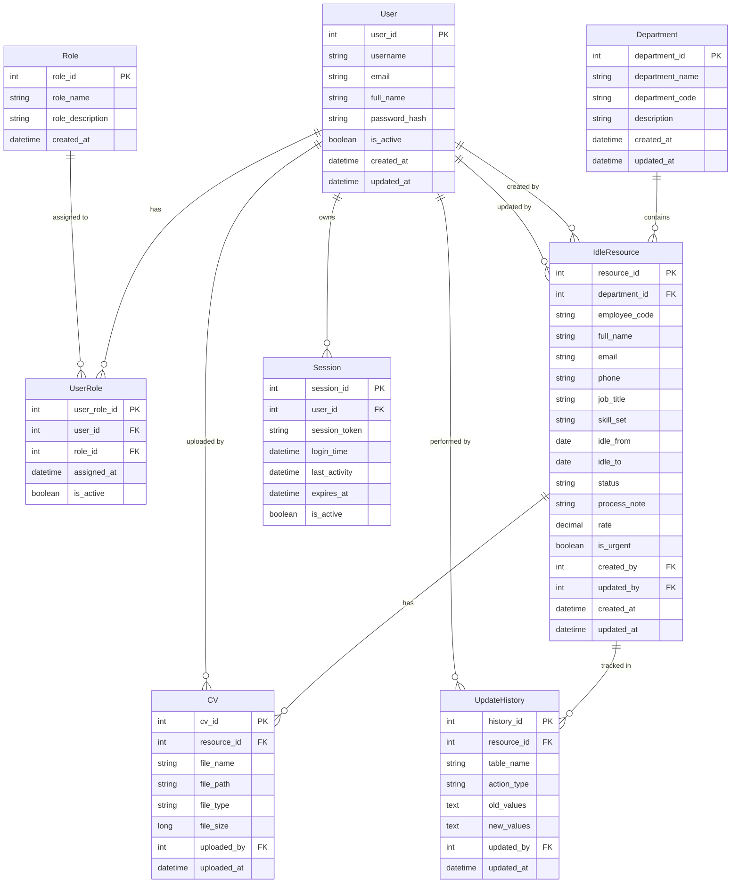
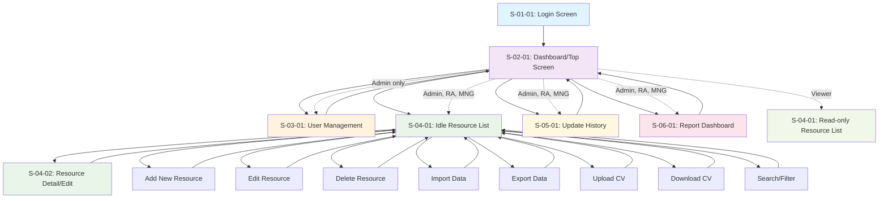

# SYSTEM REQUIREMENT DEFINITION - DATA MODEL & DIAGRAMS

## 11. Danh sách các Entity cần thiết và ER diagram

### Entity List:

| ID | Tên Entity | Mô tả |
|----|------------|-------|
| **E-01** | User | Thông tin người dùng hệ thống |
| **E-02** | Role | Vai trò và quyền hạn |
| **E-03** | UserRole | Liên kết người dùng với vai trò |
| **E-04** | IdleResource | Thông tin nhân sự đang idle |
| **E-05** | Department | Thông tin phòng ban |
| **E-06** | CV | Thông tin curriculum vitae |
| **E-07** | UpdateHistory | Lịch sử cập nhật |
| **E-08** | Session | Thông tin phiên đăng nhập |

### ER Diagram:

## 12. Sơ đồ di chuyển chức năng trong hệ thống

## 13. Luồng nghiệp vụ chính (Main Business Flows)

### Luồng 1: Đăng nhập hệ thống
**Actor**: Tất cả người dùng  
**Mục đích**: Xác thực và khởi tạo phiên làm việc

1. Người dùng truy cập màn hình đăng nhập (S-01-01)
2. Nhập username và password
3. Hệ thống xác thực thông tin
4. Nếu thành công: tạo session và chuyển đến Dashboard (S-02-01)
5. Nếu thất bại: hiển thị thông báo lỗi
6. Hệ thống kiểm tra session timeout định kỳ

### Luồng 2: Quản lý Idle Resource (RA/MNG)
**Actor**: RA, Manager  
**Mục đích**: Thêm, sửa, xóa thông tin nhân sự idle

1. Từ Dashboard, chọn "Quản lý Idle Resource" → S-04-01
2. Xem danh sách idle resource hiện tại
3. **Thêm mới**:
   - Nhấn "Add New" → S-04-02
   - Nhập thông tin bắt buộc (tên, email, idle from, department, etc.)
   - Upload CV (tùy chọn)
   - Lưu → Hệ thống tạo record mới + log history
4. **Chỉnh sửa**:
   - Chọn record → S-04-02
   - Cập nhật thông tin → Lưu → Log history
5. **Xóa**: Chọn record(s) → Xác nhận xóa → Log history

### Luồng 3: Tìm kiếm và Filter (Tất cả role)
**Actor**: Admin, RA, MNG, Viewer  
**Mục đích**: Tìm thông tin idle resource theo tiêu chí

1. Tại S-04-01, sử dụng search box hoặc filter
2. Nhập từ khóa tìm kiếm trên header hoặc title
3. Áp dụng filter theo department, status, idle date, etc.
4. Hệ thống hiển thị kết quả phù hợp với quyền của user
5. **Highlight logic**:
   - Màu vàng: Resource chưa chốt ngày Idle From
   - Icon urgent: Idle date ≥ 2 tháng

### Luồng 4: Import/Export dữ liệu (RA)
**Actor**: RA  
**Mục đích**: Xử lý dữ liệu hàng loạt

**Import**:
1. Từ S-04-01, chọn "Import"
2. Upload file Excel/CSV đúng format
3. Hệ thống validate dữ liệu
4. Hiển thị preview → Xác nhận import
5. Tạo batch job B-04 → Log tất cả thay đổi

**Export**:
1. Từ S-04-01, áp dụng filter mong muốn
2. Chọn "Export" → Chọn format (CSV/Excel)
3. Tạo batch job B-05 → Download file

### Luồng 5: Xem báo cáo Dashboard (RA/MNG)
**Actor**: RA, Manager  
**Mục đích**: Phân tích tình hình idle resource

1. Từ Dashboard, chọn "Reports" → S-06-01
2. Chọn loại báo cáo:
   - Tình hình idle theo bộ phận
   - So sánh với tuần trước
3. Áp dụng filter by Source
4. Hệ thống generate dashboard real-time
5. Option export báo cáo ra PDF/CSV

---
*Tài liệu này là phần 3 của System Requirement Definition theo chuẩn IPA.*
