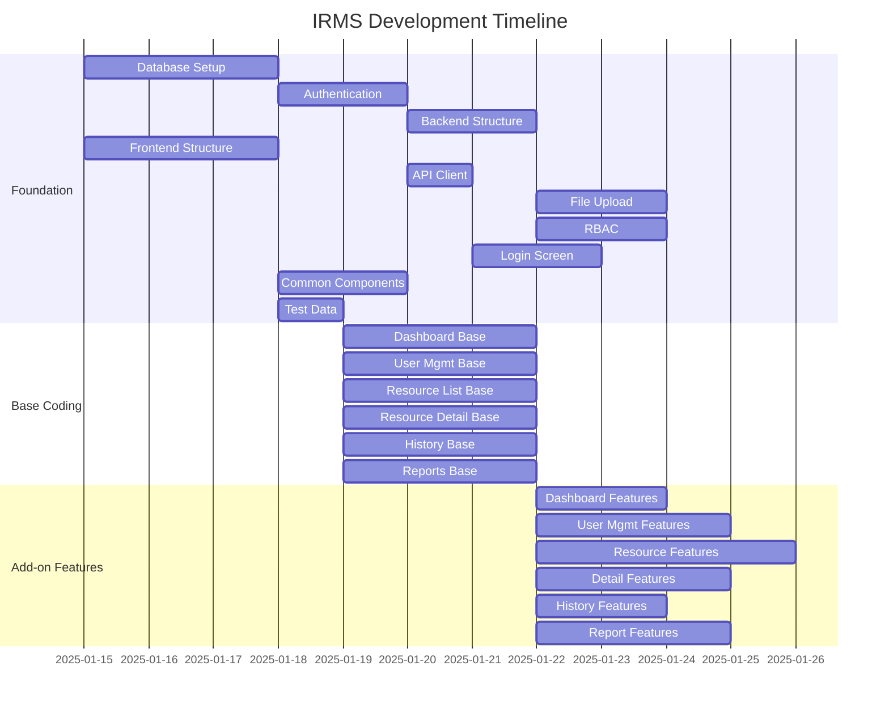

# Task List: FJP Idle Resource Management System (IRMS)

## 1. Foundation Tasks (Critical Path)

| Task ID | Task Name | Description | Dependencies | Assignee Type |
|---------|-----------|-------------|--------------|----------------|
| F001 | Database Schema Setup | Create MySQL database schema with all entities (User, IdleResource, Department, CVFile, UpdateHistory) using TypeORM migrations. Include indexes, constraints, and initial seed data | None | Senior Dev |
| F002 | Authentication System | Implement JWT-based authentication with NestJS Guards, JWT Strategy, login/logout endpoints, session management, and password hashing with bcrypt | F001 | Senior Dev |
| F003 | Backend Core Structure | Set up NestJS application structure with modules, guards, interceptors, exception filters, CORS configuration, and middleware setup | F001, F002 | Senior Dev |
| F004 | Frontend Core Structure | Set up Next.js 15 App Router structure with TypeScript, Material-UI theme, Tailwind CSS integration, TanStack Query setup, and middleware for route protection | None | Senior Dev |
| F005 | API Client & Error Handling | Configure Axios client with interceptors for authentication, error handling, request/response formatting, and global error boundary components | F002, F004 | Senior Dev |
| F006 | File Upload Service | Implement file upload service with multer configuration, file validation (PDF, DOC, DOCX, XLS, XLSX), size limits (10MB), secure file storage, and download functionality | F003 | Senior Dev |
| F007 | Role-based Access Control | Implement role-based permissions system with decorators, guards, and middleware for Admin, RA, Manager, Viewer roles across all endpoints | F002, F003 | Senior Dev |
| F008 | Login Screen Implementation | Complete S-01-01 Login Screen with form validation, authentication flow, session management, remember me functionality, and error handling | F002, F004, F005 | Senior Dev |
| F009 | Layout Implementation | Create layout components (Header, Sidebar, Footer) with responsive design and navigation & empty page for idle resources , dashboard ...etc | F004, F005, F008 | Senior Dev |
| F010 | Common Components & Utilities | Create reusable UI components (DataTable, FormControls, Modals, Notifications), utility functions, constants, and TypeScript type definitions | F004 | Senior Dev |

## 2. Business Screen Base Coding Tasks

| Task ID | Screen ID & Name | Task Name | Description | Dependencies | Assignee Type |
|---------|-----------|-----------|-------------|--------------|----------------|
| BC001 | S-02-01 Dashboard | Base Implementation | **Controller Foundation**: Dashboard controller with statistics endpoints, department filtering, recent activities API. **Service Structure**: Dashboard service with data aggregation methods, TODO comments for business logic. **Mock UI Development**: Complete dashboard layout with Material-UI cards, charts placeholders, quick actions, responsive design. **Frontend Mock Data**: Static dashboard statistics, department breakdown data, recent activities array | F001-F010 | Mid Dev |
| BC002 | S-03-01 User Management | Base Implementation | **Controller Foundation**: User CRUD controller with endpoints for list, create, update, delete, bulk operations, import/export. **Service Structure**: User service with method signatures, validation, TODO comments. **Mock UI Development**: User management table with search, filters, pagination, user forms, bulk actions UI. **Frontend Mock Data**: Static user list, role options, department options for testing | F001-F010 | Mid Dev |
| BC003 | S-04-01 Resource List | Base Implementation | **Controller Foundation**: Resource list controller with filtering, search, pagination, import/export, bulk operations endpoints. **Service Structure**: Resource service with CRUD methods, search logic, TODO comments. **Mock UI Development**: Resource list table with advanced filtering, search, column management, bulk actions. **Frontend Mock Data**: Static resource list with various statuses, departments, mock urgent indicators | F001-F010 | Mid Dev |
| BC004 | S-04-02 Resource Detail/Edit | Base Implementation | **Controller Foundation**: Resource detail controller with CRUD, CV management endpoints. **Service Structure**: Resource detail service with form handling, validation, TODO comments. **Mock UI Development**: Comprehensive resource form with all fields, CV upload/download UI, validation display. **Frontend Mock Data**: Sample resource detail data, department options, status options | F001-F010 | Mid Dev |
| BC005 | S-05-01 Update History | Base Implementation | **Controller Foundation**: History controller with filtering, pagination, export endpoints. **Service Structure**: History service with query methods, filtering logic, TODO comments. **Mock UI Development**: History table with advanced filters, search, export options, change details modal. **Frontend Mock Data**: Static history records with various action types and change descriptions | F001-F010 | Mid Dev |
| BC006 | S-06-01 Report Dashboard | Base Implementation | **Controller Foundation**: Reports controller with dashboard data, generation, export endpoints. **Service Structure**: Reports service with aggregation methods, chart data preparation, TODO comments. **Mock UI Development**: Report dashboard with charts, comparison tables, filters, export options. **Frontend Mock Data**: Static report data, chart data, comparison statistics | F001-F010 | Mid Dev |

## 3. Business Screen Add-on Feature Tasks

| Task ID | Screen ID & Name | Event ID | Task Name | Description | Dependencies | Assignee Type |
|---------|-----------|-----------|-----------|-------------|--------------|----------------|
| BE001 | S-02-01 Dashboard | S02-EVT-01 | Dashboard Data Loading | Implement dashboard statistics loading with role-based filtering, real-time data aggregation, department charts generation, and recent activities from database | BC001 | Mid Dev |
| BE002 | S-02-01 Dashboard | S02-EVT-02 | Navigation Menu Logic | Implement left menu navigation with permission checks, active state management, role-based menu items, and screen transitions | BC001 | Mid Dev |
| BE003 | S-02-01 Dashboard | S02-EVT-04 | User Logout Functionality | Implement logout with session cleanup, token invalidation, localStorage clearing, and redirect to login screen | BC001 | Mid Dev |
| BE004 | S-02-01 Dashboard | S02-EVT-06,S02-EVT-07 | Quick Actions & Dashboard Refresh | Implement quick action buttons with permission checks and dashboard auto-refresh functionality with real-time data updates | BC001 | Mid Dev |
| BE005 | S-03-01 User Management | S03-EVT-01 | User List Loading & Pagination | Implement user list loading with server-side pagination, role-based filtering, and search functionality | BC002 | Mid Dev |
| BE006 | S-03-01 User Management | S03-EVT-03 | Create New User | Implement user creation with form validation, unique checks, password hashing, role assignment, and email validation | BC002 | Mid Dev |
| BE007 | S-03-01 User Management | S03-EVT-04 | Edit User Information | Implement user editing with data loading, validation, role change handling, and audit logging | BC002 | Mid Dev |
| BE008 | S-03-01 User Management | S03-EVT-05,S03-EVT-06 | Delete User & Toggle Status | Implement user deletion (soft delete) and status toggle with validation and dependency checks | BC002 | Mid Dev |
| BE009 | S-03-01 User Management | S03-EVT-07 | Bulk User Operations | Implement bulk actions for multiple users including activate, deactivate, and bulk delete with confirmation | BC002 | Mid Dev |
| BE010 | S-03-01 User Management | S03-EVT-08,S03-EVT-09 | Import/Export Users | Implement user import from CSV/Excel with validation, duplicate checking, and export functionality with role-based data filtering | BC002 | Mid Dev |
| BE011 | S-04-01 Resource List | S04-EVT-01 | Resource List Loading & Role Filtering | Implement resource list loading with role-based data filtering, department restrictions for Managers, and column visibility by role | BC003 | Mid Dev |
| BE012 | S-04-01 Resource List | S04-EVT-02,S04-EVT-03 | Search & Advanced Filtering | Implement search across name, skills, department with advanced filters for status, dates, urgency | BC003 | Mid Dev |
| BE013 | S-04-01 Resource List | S04-EVT-04,S04-EVT-05 | Add/Edit Resource Navigation | Implement resource creation and editing navigation with permission checks and data pre-loading | BC003, BC004 | Mid Dev |
| BE014 | S-04-01 Resource List | S04-EVT-06,S04-EVT-07 | Delete Resources | Implement single and bulk resource deletion with permission validation, CV cleanup, and history logging | BC003 | Mid Dev |
| BE015 | S-04-01 Resource List | S04-EVT-08,S04-EVT-09 | Import/Export Resources | Implement resource import from CSV with comprehensive validation, duplicate checking, and export with role-based column filtering | BC003 | Mid Dev |
| BE016 | S-04-01 Resource List | S04-EVT-10,S04-EVT-11 | CV Download Operations | Implement single and multiple CV download with permission checks, ZIP file creation for bulk downloads, and download logging | BC003 | Mid Dev |
| BE017 | S-04-01 Resource List | S04-EVT-12,S04-EVT-13 | Column Management | Implement column show/hide, pinning functionality with user preference persistence and responsive behavior | BC003 | Mid Dev |
| BE018 | S-04-02 Resource Detail | S04E-EVT-01 | Resource Form Loading | Implement resource form initialization with data loading for edit mode, department options loading, and form mode detection | BC004 | Mid Dev |
| BE019 | S-04-02 Resource Detail | S04E-EVT-02,S04E-EVT-03 | Form Validation & Field Changes | Implement comprehensive form validation with cross-field validation, real-time validation, and business rules enforcement | BC004 | Mid Dev |
| BE020 | S-04-02 Resource Detail | S04E-EVT-04,S04E-EVT-05,S04E-EVT-06 | CV Management | Implement CV upload, download, and delete functionality with file validation, secure storage, and file type restrictions | BC004 | Mid Dev |
| BE021 | S-04-02 Resource Detail | S04E-EVT-07 | Save Resource | Implement resource save/update with validation, business rule checks, urgent status calculation, and history logging | BC004 | Mid Dev |
| BE022 | S-04-02 Resource Detail | S04E-EVT-08,S04E-EVT-09 | Delete Resource & Navigation | Implement resource deletion and navigation back to list with unsaved changes detection and confirmation | BC004 | Mid Dev |
| BE023 | S-04-02 Resource Detail | S04E-EVT-10 | Auto-save Draft | Implement auto-save functionality for form drafts with periodic saving and draft restoration | BC004 | Mid Dev |
| BE024 | S-05-01 Update History | S05-EVT-01 | History Loading & Role Filtering | Implement history loading with role-based filtering (Manager sees department only), pagination, and summary statistics | BC005 | Mid Dev |
| BE025 | S-05-01 Update History | S05-EVT-02,S05-EVT-03 | History Filtering & Search | Implement advanced history filtering by date range, user, action type, resource search with real-time updates | BC005 | Mid Dev |
| BE026 | S-05-01 Update History | S05-EVT-04,S05-EVT-05 | Export History & Reports | Implement history export to CSV with filtering and summary report generation with statistics | BC005 | Mid Dev |
| BE027 | S-05-01 Update History | S05-EVT-07,S05-EVT-08 | Auto Refresh & Change Details | Implement auto-refresh functionality and detailed change view modal with old vs new value comparison | BC005 | Mid Dev |
| BE028 | S-06-01 Report Dashboard | S06-EVT-01 | Report Data Loading | Implement report dashboard data loading with role-based department filtering and statistics calculation | BC006 | Mid Dev |
| BE029 | S-06-01 Report Dashboard | S06-EVT-02,S06-EVT-04 | Filters & Comparison | Implement report filters by department and period with comparison functionality against previous periods | BC006 | Mid Dev |
| BE030 | S-06-01 Report Dashboard | S06-EVT-03,S06-EVT-05 | Report Generation & Export | Implement custom report generation and export to multiple formats (PDF, Excel, CSV) with chart inclusion | BC006 | Mid Dev |
| BE031 | S-06-01 Report Dashboard | S06-EVT-06,S06-EVT-07 | Advanced Charts & PDF | Implement detailed chart views with drill-down functionality and comprehensive PDF report generation | BC006 | Mid Dev |
| BE032 | S-06-01 Report Dashboard | S06-EVT-08,S06-EVT-09,S06-EVT-10 | Email Reports & Auto Refresh | Implement email report functionality, auto-refresh settings, and manual refresh with real-time updates | BC006 | Mid Dev |
| BE033 | All Screens | CMN-EVT-01 | Session Management | Implement session timeout checking, token refresh, automatic logout, and session validation across all screens | All BC tasks | Mid Dev |
| BE034 | All Screens | CMN-EVT-02,CMN-EVT-03 | Permission & Error Handling | Implement comprehensive permission checking and global error handling with user-friendly messages and recovery options | All BC tasks | Mid Dev |
| BE035 | All Screens | CMN-EVT-04,CMN-EVT-05 | Form Validation & Loading States | Implement reusable form validation system and loading state management across all screens | All BC tasks | Mid Dev |

## Dependency Matrix

## Parallel Development Strategy

### Phase 1: Foundation (Weeks 1-2)
| Developer Type | Parallel Tasks | Duration |
|----------------|----------------|----------|
| **Senior Dev 1** | F001 (Database) → F002 (Auth) → F007 (RBAC) | 7 days |
| **Senior Dev 2** | F004 (Frontend) → F009 (Components) → F008 (Login) | 7 days |
| **Senior Dev 3** | F003 (Backend) → F006 (Files) → F005 (API Client) | 7 days |
| **Mid Dev** | F010 (Test Data) → Documentation → Testing | 3 days |

### Phase 2: Base Coding (Weeks 3-4)
| Developer Type | Parallel Tasks | Duration |
|----------------|----------------|----------|
| **Mid Dev 1** | BC001 (Dashboard) → BC002 (Users) | 6 days |
| **Mid Dev 2** | BC003 (Resources) → BC004 (Detail) | 6 days |
| **Mid Dev 3** | BC005 (History) → BC006 (Reports) | 6 days |

### Phase 3: Add-on Features (Weeks 5-7)
| Developer Type | Parallel Tasks | Duration |
|----------------|----------------|----------|
| **Mid Dev 1** | BE001-BE004 (Dashboard) → BE033-BE035 (Common) | 8 days |
| **Mid Dev 2** | BE005-BE010 (User Mgmt) → BE024-BE027 (History) | 8 days |
| **Mid Dev 3** | BE011-BE017 (Resource List) → BE028-BE032 (Reports) | 8 days |
| **Mid Dev 4** | BE018-BE023 (Resource Detail) → Integration Testing | 8 days |

### Resource Allocation Summary
- **3 Senior Developers** for Foundation phase (critical path)
- **4 Mid-level Developers** for Business Screen implementation
- **Maximum parallelization** achieved with minimal dependencies
- **Total timeline**: 7 weeks for complete implementation
- **Task distribution**: 10 Foundation (14%) + 6 Base Coding (9%) + 35 Add-on Features (77%) = 51 total tasks

### Critical Success Factors
1. **Foundation completion** before Base Coding starts
2. **Each Base Coding task 80% complete** before corresponding Add-on tasks
3. **Role-based development** assignments based on complexity
4. **Continuous integration** and testing throughout phases
5. **Regular synchronization** between parallel development streams

---

*Generated according to AI Agent Instructions for Task List Generator - Large Scale Web Application Development*
